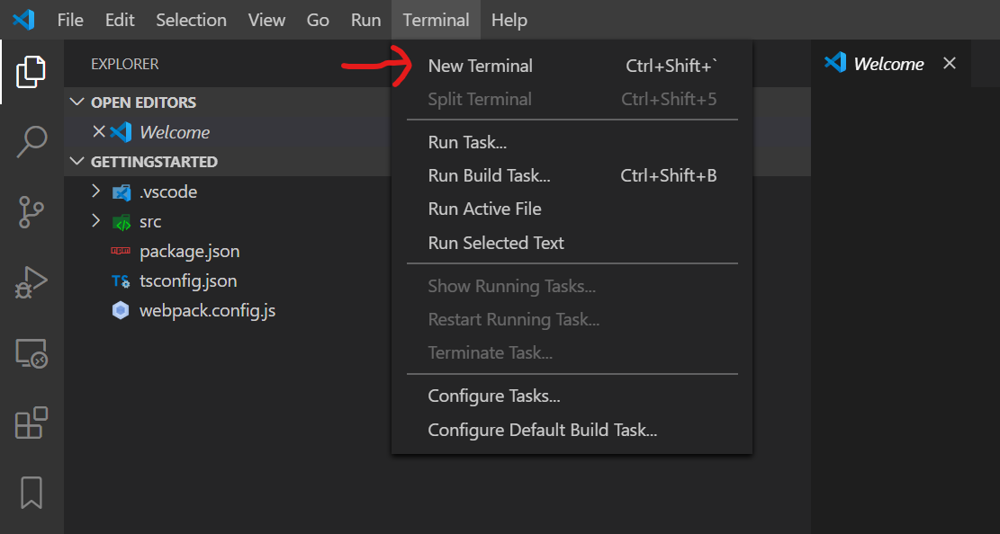

# Building your first Aardvark gadget

This is a simple step by step guide to building your first Aardvark gadget.
Assuming you have the pre-requisites installed already, this will take about ten minutes.

This guide uses Typescript, Visual Studio Code, and npm.
Using Javascript to build your gadget should be straightforward... just use .js files below instead of .ts files and omit the type declarations.

# Step 0 - Pre-requisites

There are some pre-requisites to following the rest of this guide.
Specifically you need to have the following applications installed:
* (Visual Studio Code)[https://code.visualstudio.com/download)
* (npm)[https://www.npmjs.com/get-npm]
* typescript - Once npm is installed, you can install typescript with `npm install -g typescript`
* avcmd - This is a command line tool for Aardvark developers. Once npm is installed, you can install it with `npm install -g @aardvarkxr/aardvark-cli`.

There's nothing in the instructions below that cares what platform you're running on, but these instructions have only been tested on Windows 10.
Aardvark itself also currently only runs on Windows.

# Step 1 - Initialize an empty gadget

The Aardvark init tool will help you create a mostly-blank project in the current directory.

```console
E:\gettingstarted>npm init @aardvarkxr
Aardvark gadget project create script (0.4.0)
? What is the package name to use for your gadget? mygadget
? What is the package name to use for your gadget? mygadget
? What is the user-facing name of your gadget? My Awesome Gadget
? What is the user-facing name of your gadget? My Awesome Gadget
? Does your gadget use panels (i.e. 2D quads in the world)? (Y/n)
? Does your gadget use panels (i.e. 2D quads in the world)? Yes
? Texture width (1024)
? Texture width 1024
? Texture height (1024)
? Texture height 1024
? Does your gadget start other gadgets? (y/N)
? Does your gadget start other gadgets? No
? Does your gadget join multi-user chambers? (y/N)
? Does your gadget join multi-user chambers? No
? Do you want to debug with VS Code? (Y/n)
? Do you want to debug with VS Code? Yes
Your answers:  {
  packageName: 'mygadget',
  gadgetName: 'My Awesome Gadget',
  usesPanels: true,
  width: 1024,
  height: 1024,
  startsGadgets: false,
  joinsChambers: false,
  wantsVSCode: true
}
Using @aardvarkxr/aardvark-react@^0.4.0 and @aardvarkxr/aardvark-shared@^0.4.0
Created ./src
Added gadget_manifest.json
Added tsconfig.json
Added package.json
Added src/styles.css
Added src/main.tsx
Added src/index.html
Created ./src/models
Added src/models/placeholder.glb
Added webpack.config.js
Created ./.vscode
Added .vscode/launch.json
```

This results in the following files:
```
E:\GETTINGSTARTED
|   package.json
|   tsconfig.json
|   webpack.config.js
|
+---.vscode
|       launch.json
|
\---src
    |   gadget_manifest.json
    |   index.html
    |   main.tsx
    |   styles.css
    |
    \---models
            placeholder.glb
```

Now that you have a gadget project, open it in Visual Studio code.

```console
E:\gettingstarted> code .
```

# Step 2 - Build your gadget for the first time

In the terminal window in Visual Studio code, you need to tell npm to install all the dependencies of your gadget. 
This will download a bunch of typescript and javascript files into `E:\gettingstarted\node_modules`.

First, open the terminal window from the Terminal menu:


In the pane that appears, run npm install.
You will need to do this whenever you change package.json to add dependencies.
This guide will walk through enough npm commands to get a gadget up and running, but if want to learn more about npm [An Absolute Beginner's Guide to npm](https://nodesource.com/blog/an-absolute-beginners-guide-to-using-npm/) would be a good place to start.
(This output was truncated because npm loves to spam the console, and the specific spam varies from week to week depending on other people's modules, the specific npm version, security alerts, and the phase of the moon.)

```console
PS E:\gettingstarted> npm install
npm WARN deprecated request@2.88.2: request has been deprecated, see https://github.com/request/request/issues/3142

> node@12.16.1 preinstall E:\gettingstarted\node_modules\node
> node installArchSpecificPackage

+ node-win-x64@12.16.1
added 1 package in 1.019s
found 0 vulnerabilities

npm notice created a lockfile as package-lock.json. You should commit this file.
npm WARN optional SKIPPING OPTIONAL DEPENDENCY: fsevents@^1.2.7 (node_modules\chokidar\node_modules\fsevents):
npm WARN notsup SKIPPING OPTIONAL DEPENDENCY: Unsupported platform for fsevents@1.2.12: wanted {"os":"darwin","arch":"any"} (current: {"os":"win32","arch":"x64"})
npm WARN mygadget@0.1.0 No repository field.
npm WARN mygadget@0.1.0 No license field.
...

added 999 packages from 1189 contributors and audited 54181 packages in 31.898s

21 packages are looking for funding
  run `npm fund` for details

found 0 vulnerabilities
```

Now that the dependencies are installed we can start the actual build.

```console

PS E:\gettingstarted> npm start

> mygadget@0.1.0 start E:\gettingstarted
> webpack --env=dev --watch --progress

10% [0] building 0/0 modules 0 active
webpack is watching the files…

Hash: 7761bd5deb168075e44e
Version: webpack 4.42.1
Child
    Hash: 7761bd5deb168075e44e
    Time: 3014ms
    Built at: 04/04/2020 9:47:13 AM
                     Asset       Size  Chunks             Chunk Names
              ./index.html  297 bytes          [emitted]
      gadget_manifest.json  168 bytes          [emitted]
                  index.js   10.9 MiB    main  [emitted]  main
                 main.d.ts   12 bytes          [emitted]
    models/placeholder.glb   9.38 KiB          [emitted]
                styles.css  391 bytes          [emitted]
    Entrypoint main = index.js
    [0] util (ignored) 15 bytes {main} [built]
    [1] util (ignored) 15 bytes {main} [built]
    [2] buffer (ignored) 15 bytes {main} [optional] [built]
    [3] crypto (ignored) 15 bytes {main} [optional] [built]
    [./node_modules/webpack/buildin/global.js] (webpack)/buildin/global.js 472 bytes {main} [built]
    [./node_modules/webpack/buildin/module.js] (webpack)/buildin/module.js 497 bytes {main} [built]
    [./src/main.tsx] 3.67 KiB {main} [built]
        + 167 hidden modules
    Child html-webpack-plugin for "index.html":
         1 asset
        Entrypoint undefined = ./index.html
        [./node_modules/html-webpack-plugin/lib/loader.js!./src/index.html] 428 bytes {0} [built]
        [./node_modules/webpack/buildin/global.js] (webpack)/buildin/global.js 472 bytes {0} [built]
        [./node_modules/webpack/buildin/module.js] (webpack)/buildin/module.js 497 bytes {0} [built]
            + 1 hidden module

```
